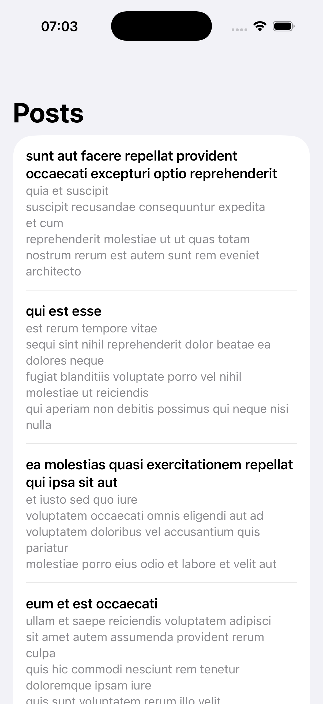

# Posts-Practice

A practice project created to demonstrate the implementation of Networking, Dependency Injection, MVVM architecture and Unit Testing. Focus on clean architecture and code reliability, not design.

## Screenshots

  

## Features
- Fetch posts from remote API (JSONPlaceholder)
- Error handling
- Mock service for testing and previews

## Stack
- Swift / SwiftUI
- URLSession (Networking)
- XCTest (Unit Testing)
- MVVM

## Testing
The project features a dedicated Unit Testing suite built with 'XCTest'.
MockPostService allows testing success and failure states without real network calls.

## Requirements
- iOS 17+
- Xcode 15+
